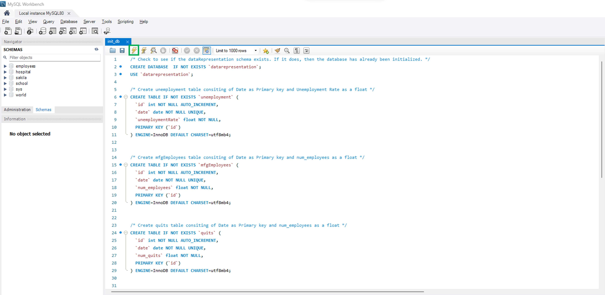
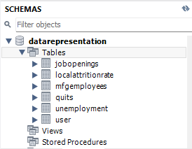
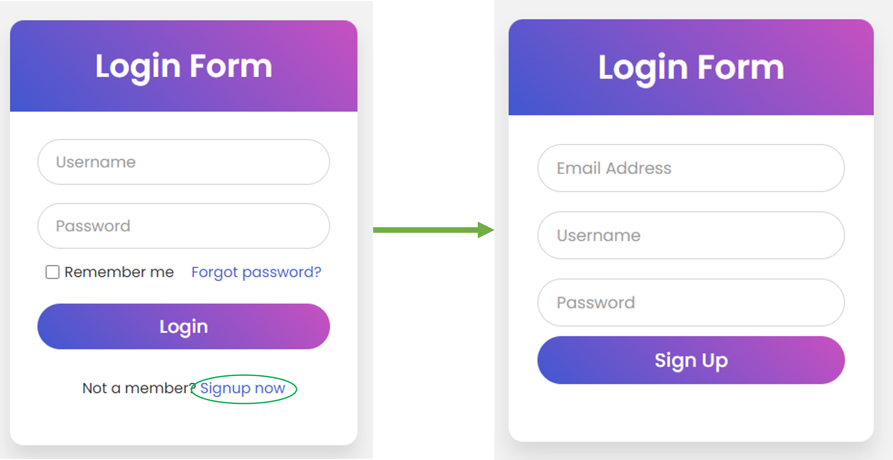
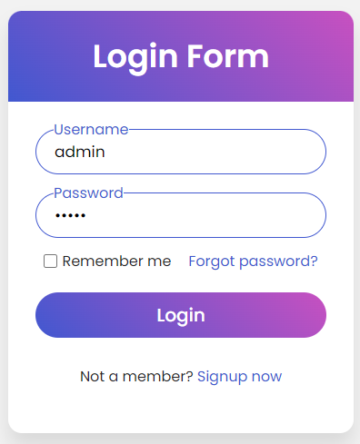
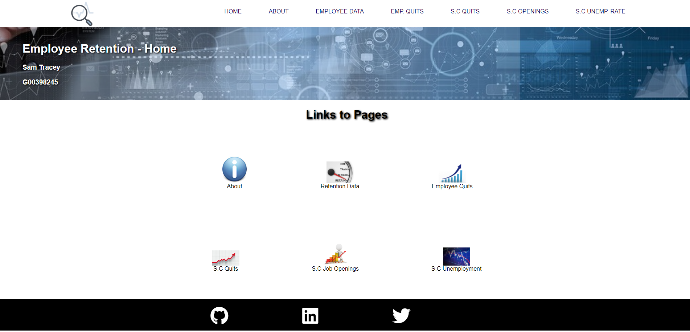
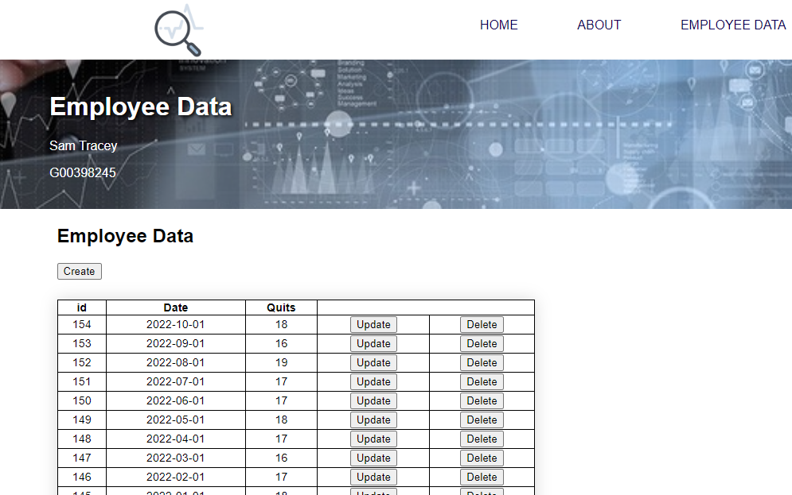
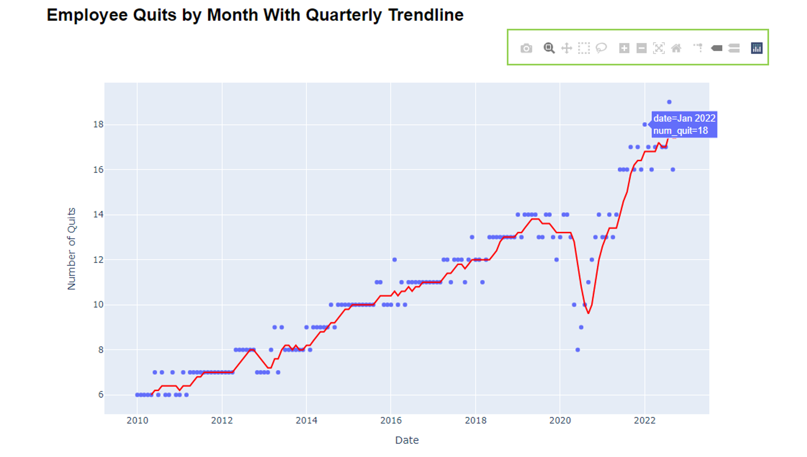

***

#### Student: Sam Tracey
#### Student ID: G00398245
#### Module: Data Representation
#### Topic: Big Project

***
 

### Introduction  

 The purpose of this project is to demonstrate an understanding of the creation and consumption of RESTful APIs.
    
This project uses Flask in conjunction with a MySQL database to create a web application that allows a user to consume the API to perform CRUD operations on the stored data.

This project is centered around the provision of an Analytics web application which can be used by my current employer.

### Overview of Zeus Industrial Products  

 <a href="https://www.zeusinc.com/company/">Zeus Industrial Products</a> is a global leader in advanced polymer solutions, helping customers overcome complex design and engineering challenges for over 50 years. With manufacturing and sales facilities across three continents and a presence in 180 countries worldwide, Zeus develops and delivers customized polymer solutions for companies in the medical, automotive, aerospace, fiber optics, energy, and fluid management markets.
    
Headquartered in Orangeburg, SC, USA, Zeus employs over 1,800 people worldwide across its facilities in Aiken, Columbia, Gaston, and Orangeburg, South Carolina; Branchburg, New Jersey; Chattanooga, Tennessee; San Jose, California; Guangzhou, China; and Letterkenny, Ireland.
    
Like many large corporations primarily based in the USA, employee attrition has become of greater concern in the past number of years.

### Purpose of This Project  

The primary purpose of this project is to provide our leadership team with insights into the employee attrition rate at the company as well as trends in macro economic data that could be correlated.
    
**Please note: Since the employee attrition rate is confidential information we will be using synthetic data for the purpose of this project**

***
### Data Sources  

 Our synthetic employee attrition data is initially stored in a .csv file before being read into our MySQL database. We also extract the following macro economic data:

* <a href="https://fred.stlouisfed.org/series/SCUR">Unemployment Rate in South Carolina</a> 
* <a href="https://fred.stlouisfed.org/series/JTS00SOQUL">Quits: Total Nonfarm in South Census Region</a>
* <a href="https://fred.stlouisfed.org/series/JTS00SOJOL">Job Openings: Total Nonfarm in South Census Region</a>

These data sets are extracted directly from the <a href="https://fred.stlouisfed.org/docs/api/fred/">FRED API</a> and stored in our MySQL database.

***

### Repository Contents  

 This repository contains the following files:
    
* <code>app.py</code> Python Flask server application program.
* <code>config.py</code> Python configuration file with credentials for the MySQL database and FRED API.
* <code>dataDAO.py</code> Python file which enables interaction with the MySQL database.
* <code>init_db.sql</code> SQL file which allows the datarepresentation schema and relevant MySQL tables to be initilised.
* <code>local_quits.csv</code> CSV file which contains the syntetic data for local employee attrition</code>
* <code>README.md</code> Readme file.
* <code>requirements.txt</code> File containing the Python packages required to run the application.
* <code>static</code> Folder containing the images used in the webpages (images folder) and css styles used for the webpages (styles folder).
* <code>templates</code> Folder containing 10 .html pages used for the web application.
* <code>images</code> Folder containing the images used in this Readme document.

***

### To Run the Application.  

 The Github Repositry for this project can be accessed at: <a href="https://github.com/Sam-Tracey/Data_Representation_Project">This Link</a> From here you can click on the green Code button and clone the repo to your local machine by following the instructions.

MySQL is required for this application. You can download MySQL Work bench here: https://dev.mysql.com/downloads/workbench/
    
Once downloaded you will need to initialize the datarepresentation schema.This can be done by copying the contents of the <code>init_db.sql</code> file that you have cloned from Github and pasting it into a New Query tab. Once pasted, click on the Execute Icon as shown below:
 
 

 
 
Once executed you will see a new schema created containing 6 tables: 
 

 
 

 Now that the schema and relevant tables are set up, it is time to create a virtual environment. To do this, navigate to the folder where you cloned the original Github Repository to and open a Command Line Interface.
After the terminal loads type: <code>python -m venv venv</code>. It will take a few minutes for the virtual environment to create. 
Once created, type: <code>.\venv\Scripts\activate.bat</code> to activate the virtual environment. 
 
    The <code>requirements.txt</code> contains a list of all Python packages required to run the application. To install all these packages within your virtual environment type <code>pip install -r requirements.txt</code> on your command line interface. 
After a few minutes the relevant packages will install. 
 
To run the application type the following into your CLI: <code>python app.py</code>  
This will initiate a Python webserver which runs locally on your machine.  
To access the webserver open a web browser and type the following address: http://127.0.0.1:5000   

***
    
### Setting Up The First User  
    

The first screen you will be presented with is the Log In page. This page allows existing users to access the dashboard. As the user table in the datarepresentation schema is currently empty, you will need to "sign up" a new user by clicking on the link shown below: 
 
    
  
    
Enter any email address, username and password then click "Sign Up". Once you click "Sign Up" the data entered will be written to the user table of the datarepresentation schema and you will be returned to the Log In page. 
Enter the username and password you just signed up with and click "Login"
  

     

Successful Login will take you to the Home Page where you can navigate the other webpages either via the icon links or top Navigation Bar.  

  

***

### CRUD Operations

As well as being able to create new users to access the web application, we can perform CRUD operations in the "EMPLOYEE DATA" tab. Here as well as Reading the initial data that will have been loaded from the .csv file, the user will be able to Update, Delete and Create new entries.Create, Update or Delete actions will automatically write to the user table in MySQL.  

    
  

***

### Interactive Dashboard.  

There are 4 tabs in the web application that have interactive charts and tables for the local attrition data, Southern Census Quits data, South Carolina Unemployment Rate and South Census Job Openings data. 
Each of the charts displayed is interactive, you can scroll over a data point to see a "tool-tip" with the relevant data; you can Zoom in and Zoom out; you can download a .png image of the chart. Many of these described features can be accessed from the menu bar at the top of the chart (shown below).  
    

    

***

### Hosting on Pythonanywhere  

This web application is also hosted on Pythonanywhere (using a paid subscription since its exceeded the 500Mb free limit). You can see the hosted version by visiting: 
 <a href="http://stracey.pythonanywhere.com/">stracey.pythonanywhere.com</a>  
    
The functionality is identical to the localhost version. If you want to login without signing up as a new user, an exisiting user exisits with the following (very original) credentials:

* Username: admin
* Password: admin

 
 

***

### Next Steps  

Obviously, due to the confidential nature of our company attrition rate data, we have not connected this dashboard to an "actual" live data source. All of this data is stored in our company Data Warehouse and is directly accessible via an API for those with the correct access. I would like to incorporate this API at some point. 
Secondly, our company relies on Okta to authorise access to this kind of data. Incorporating Okta authentication into this application woul ensure that only those with the required privelges could access the application. 
There is an extra table included in this project that we did not use (mfgemployees). All the code is present to read that data from FRED via its API but, in the interest of load times and response times for the web application when hosted on Pythonanywhere, I decided not to include it in the dashboard. 
I have also added functionality in the <code>app.py</code> Flask application to enable a user who forgot her / his password to send an email with the email that is stored in the user table. Because you need to enter credentials for the Mail Server - including a username and password, I decided not to deploy this feature. The code is included (but commented out)  

***

### References and Documentation.

 
* The Federal Reserve Economic Data: https://fred.stlouisfed.org/ 

* MySQL Documentation: https://www.mysql.com/products/workbench/

* Python Flask Documentation: https://flask.palletsprojects.com/en/2.2.x/

* Python Virtual Environments: https://docs.python.org/3/tutorial/venv.html

* Python Anwhere: https://blog.pythonanywhere.com/121/

* Plotly Express (Interactive charts): https://plotly.com/python/plotly-express/

* Displaying Plotly Express Charts via Flask: https://towardsdatascience.com/web-visualization-with-plotly-and-flask-3660abf9c946

* Display Plotly Tables via Flask: https://plotly.com/python/table/

    

    
